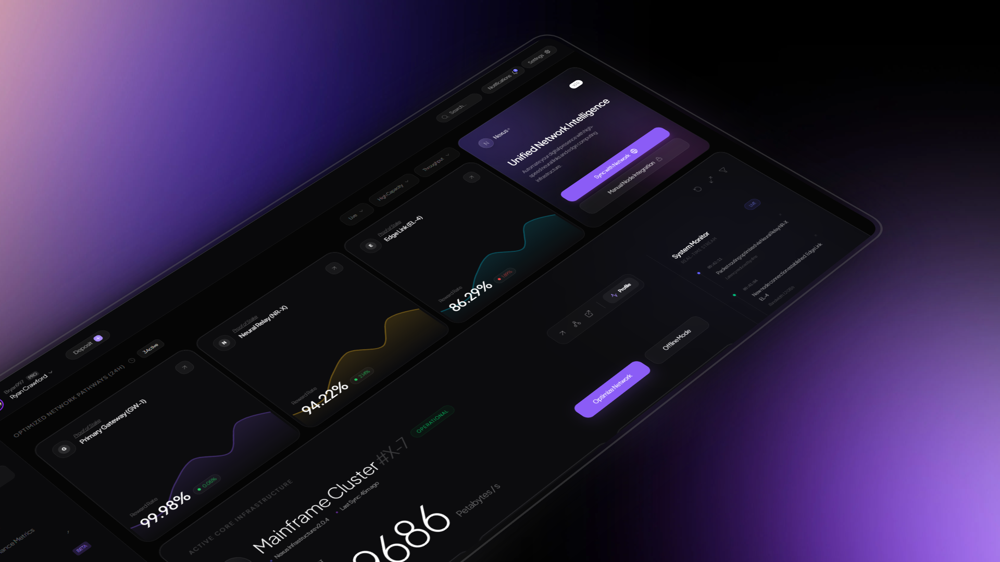

# 🌐 NEXUS | Cybernetic & Neural Network Telemetry Dashboard

[](https://nextjs.org)
[](https://tailwindcss.com)
[](https://www.framer.com/motion/)
[](https://www.typescriptlang.org/)
[](LICENSE)

**Nexus** is an ultra-premium, high-fidelity cybernetic frontend style template and UI component boilerplate built on top of Next.js and Tailwind CSS v4. It was specifically designed and engineered for developers to copy, clone, and study state-of-the-art glassmorphic layouts, futuristic color palettes, fluid typography, and premium dashboard design tokens.

---

## ✨ Features

### 1. 🌌 Unified Network Intelligence & Gateway Telemetry
- **Proof-of-Stake Gateways**: Monitored telemetry for **Primary Gateway (GW-1)**, **Neural Relay (NR-X)**, and **Edge Link (EL-4)**.
- **Dynamic Yield Charts**: Beautiful gradient-filled Area Charts powered by **Recharts** visualizing latency and reward-rate history.
- **Auto-Routing Handshake**: One-click integrations to sync edge infrastructure or verify network parameters with identity handshakes.

### 2. 🖥️ Mainframe Cluster Telemetry (#X-7)
- **Fluid Slider Telemetry**: High-precision throughput counter (`DigitSlider`) rendering real-time stream data (in Petabytes per second) with physics-based sliding digit animations using **Framer Motion**.
- **Quad-Core Hardware Diagnostics**: Granular telemetry on CPU Architecture (128-bit Quad Neural Core V3), active Threads, RAM allocation, Energy Draw (kW/h), and micro-fan cooling speeds.
- **Distributed SLA Monitoring**: Real-time evaluation of signal dynamics (Neural Flow, Topology, and Latency indices).

### 3. 📜 Live System Stream
- **Animated Activity Logs**: Chronological log stream updating on-the-fly, documenting security handshake validations, mainframe cluster auto-scalings, and packet optimization via Neural Relays.

### 4. 🗺️ Global Traffic Distribution Map
- **Vector Mesh Visualization**: Dynamic visual interface featuring a pulsating world-node grid detailing traffic saturation across global datacenters (North America, Asia-Pacific, Europe).

---

## 🛠️ Technology Stack

Nexus utilizes the latest modern frontend stack designed for fluid interactivity, modular architecture, and extreme visual polish:

* **Core Framework**: [Next.js 16 (App Router)](https://nextjs.org/) utilizing React 19 server-side rendering advantages and route optimizations.
* **Styling**: [Tailwind CSS v4](https://tailwindcss.com) with native PostCSS imports, utilizing customized themes, variables (`--color-nexus-purple`, `--color-nexus-cyan`), and custom CSS glassmorphism layers (`.glass`) with glowing top-edge lighting gradients.
* **Animations**: [Framer Motion 12](https://www.framer.com/motion/) handling fluid sliding telemetry text, micro-animations, and slide-in entries.
* **Data Visualization**: [Recharts 3](https://recharts.org/) for highly responsive gradient area charts.
* **Server State**: [TanStack React Query v5](https://tanstack.com/query) for asynchronous endpoint management and cache optimizations.
* **Icons**: [Lucide React](https://lucide.dev/) for crisp, scalable svg cybernetic graphics.

---

## 📁 Directory Structure

```bash
nexus/
├── public/                 # Static assets and icons
│   ├── preview.png         # Main dashboard preview image
│   └── avatar.png          # User avatar asset
├── src/
│   ├── app/                # Next.js App Router root & metadata
│   │   ├── globals.css     # Global CSS, typography (Google Sans Flex), glass classes
│   │   ├── layout.tsx      # Base layout context
│   │   ├── providers.tsx   # React Query & Framer Motion provider layers
│   │   └── page.tsx        # Main telemetry dashboard view & DigitSlider component
│   └── components/         # Reusable dashboard modules
│       ├── dashboard/
│       │   ├── AssetCard.tsx   # Gateway cards with Recharts gradients
│       │   └── NetworkMap.tsx  # Pulsating SVG global traffic map
│       └── layout/
│           ├── DashboardLayout.tsx
│           ├── Sidebar.tsx     # Fully-featured left side cybernetic navigation bar
│           └── TopBar.tsx      # System header with quick searches and notifications
├── next.config.ts          # Build configuration settings
├── package.json            # Script runs and dependencies listing
└── tsconfig.json           # Type definitions mapping
```

---

## 🚀 Getting Started

### Prerequisites

Make sure you have Node.js (version 18+ recommended) and npm installed.

### Installation

1. Clone the repository and navigate into it:
   ```bash
   cd nexus
   ```

2. Install the system dependencies:
   ```bash
   npm install
   ```

3. Run the application locally in development mode:
   ```bash
   npm run dev
   ```

4. Open your browser and navigate to:
   ```url
   http://localhost:3000
   ```

### Production Build

To compile a highly optimized production bundle of the application, run:
```bash
npm run build
```

Then start the production server locally:
```bash
npm run start
```

---

## 🎨 Visual Design Guidelines
Nexus features a custom glassmorphism design language tailored for terminal/high-fidelity screens:
* **Backgrounds**: High-contrast dark void (`#0a0a0c`) combined with custom high-blur glass containers (`#111114/60`).
* **Mesh Gradients**: Colorful glowing blobs blur-mapped around key interactives to draw natural focus.
* **Typography**: Clean hierarchy relying on *Google Sans Flex* and *Plus Jakarta Sans* to elevate metrics and numeric details.

---

## 📄 License & Open-Source Usage
This project is fully open-source and released under the **MIT License**. 

Anyone is free to clone this repository, copy the CSS classes, reuse the responsive layouts, extract components, or adapt the entire visual design language for their own dashboards and websites without restriction. See the [LICENSE](LICENSE) file for the full legal text.

